# <!--fit--> Informática
### Prof. Diego Cirilo
**Aula 01** Apresentação da disciplina e Introdução

---

# Ementa

---

# Motivação
- Desconhecimento em relação ao funcionamento básico do computador;
- Necessidade de utilização de ferramentas de escritório;
- Utilização segura do computador;
- Obrigatoriedade do uso durante o curso e no mercado de trabalho.

---

# Metodologia
- Aulas teóricas expositivas;
- Aulas práticas em laboratório.

---

# Avaliação
- *Quizzes* sobre parte teórica;
- Exercícios e avaliações práticas em laboratório.

---
# Reposição de avaliação

> ## Organização Didática do IFRN (2012)
> **Art. 247.** Dar-se-á uma oportunidade de reposição ao estudante que deixar de comparecer à atividade avaliativa cujo resultado seja contabilizado para a nota do bimestre.
>
> § 1. Para a realização da reposição, o estudante deverá apresentar requerimento à Diretoria Acadêmica, no prazo de até 2 (dois) dias úteis após retornar às atividades acadêmicas, pelos seguintes motivos:
>  1. tratamento de saúde, comprovado por meio de atestado médico;
>  2. ausência de transporte (inter)municipal, comprovado por meio de declaração do órgão competente da prefeitura; ou
>  3. plantão militar ou de trabalho, comprovado por meio de declaração do chefe imediato.
> § 2. Os motivos não previstos neste artigo deverão ser analisados pelo Coordenador do Curso em conjunto com o professor da disciplina.

---

# Definição
> Computador é um conjunto de dispositivos eletrônicos capazes de aceitar dados e instruções, executar essas instruções para processar os dados, e apresentar os resultados - *Academic Press Dictionary of Science Technology*.

---
# Histórico

- 1ª Geração - 1939-1950
- 2ª Geração - 1950-1960
- 3ª Geração - 1960-1973
- 4ª Geração - 1973-Atual
---
# 1ª Geração - 1939-1950 

- Grandes computadores que utilizavam válvulas termiônicas;
- Difícil manutenção;
- Alto consumo de energia;
- Programação feita em linguagem de máquina;

---
# ENIAC

- Primeiro computador eletrônico digital, construído em 1946;
- Possuia cerca de 17.468 válvulas, 7,200 diodos, 70.000 resistores, 10.000 capacitores;
- Pesava 30 toneladas, ocupava a extensão de uma quadra de tênis e tinha altura correspondente a um prédio de 3 andares;
- Consumia cerca de 150 kW de potência.

---

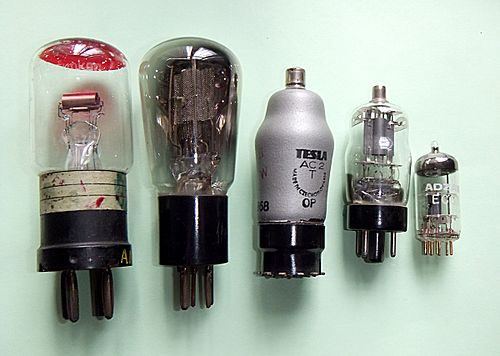

---

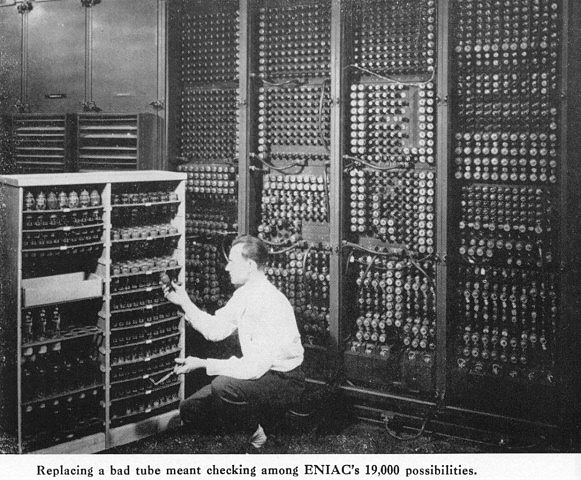

---

---

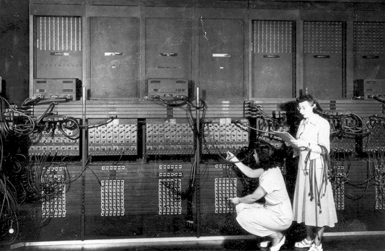

---
# 2ª Geração - 1950-1960
- As válvulas foram trocadas por transistores de silício;
- Redução do tamanho e custo;
- Aumento da rapidez e confiabilidade;
- Programação feita na linguagem Assembly;
- Criação dos primeiros minicomputadores;

---
# IBM 1401
- Altura de 1,5m e 1,2m de comprimento;
- 4KB de memória;

---

---

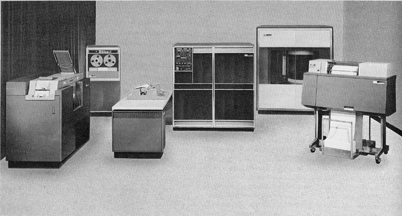

---

# 3ª Geração - 1960-1973
- Computadores com microcircuitos ou circuitos integrados (CIs);
- Aumento da capacidade de trabalho do computador;
- O computador passou a ser utilizado em bancadas;
- Grandes discos de armazenamento tinham 5MB e mediam 24 polegadas de diâmetro.

---

---

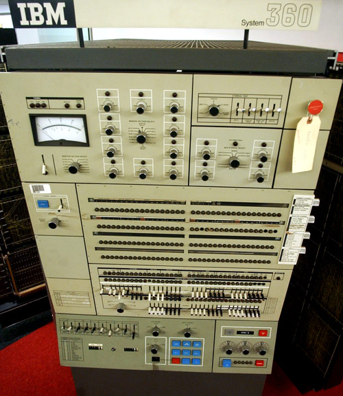

---

# 4ª Geração - 1973-Atual
- Computadores com circuitos VLSI (*Very Large Scale Integration*);
- Miniuaturização progressiva;
- O início da chamada era da microinformática.

---

---

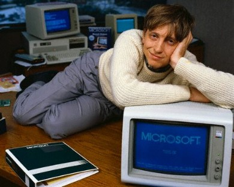

---

---

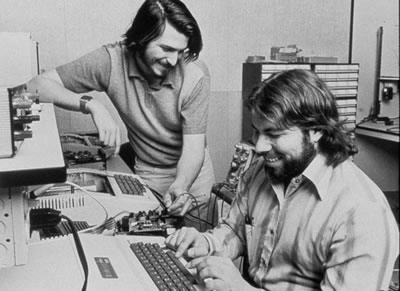

---

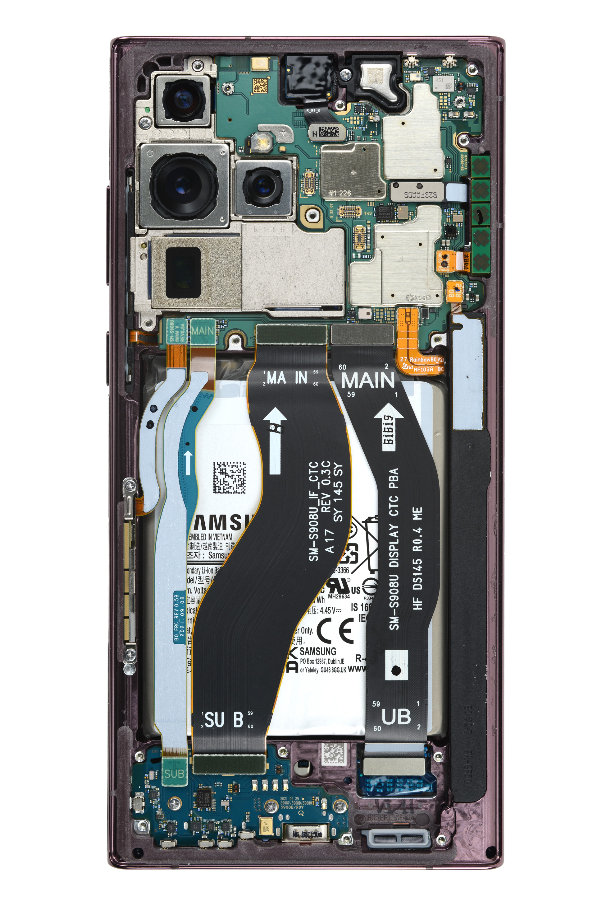
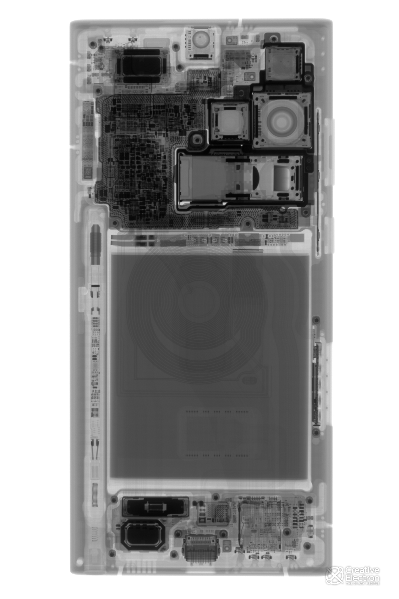

---

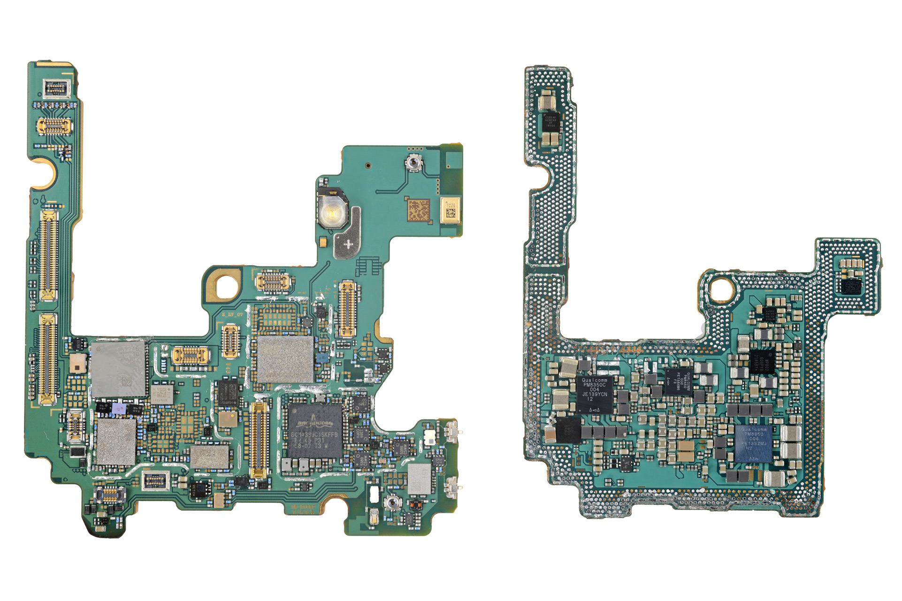
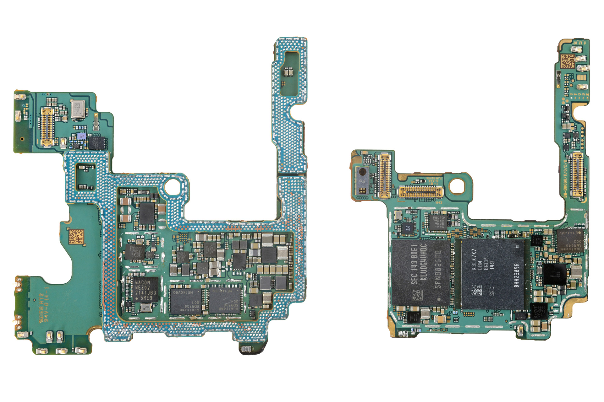

---
# <!--fit--> Dúvidas? 🤔

