# <!--fit--> Informática
### Prof. Diego Cirilo
**Aula 02** Definições e tipos de PC

---

# Definição
> **Computador** é um conjunto de dispositivos eletrônicos capazes de aceitar dados e instruções, executar essas instruções para processar os dados, e apresentar os resultados - *Academic Press Dictionary of Science Technology*.

---

# Elementos de um sistema computacional
- Os elementos de um sistema computacional podem ser divididos em:
    - **Hardware** - Parte Física;
    - **Software** - Parte Lógica;

---
# Hardware
- Conjunto de dispositivos elétricos/eletrônicos que englobam CPU, a memória e o dispositivos de entrada/saída de um sistema computacional;
- Composto de objetos tangíveis, circuitos integrados, placas de circuito, cabos, teclados, etc;
- Parte **física**.

---
# Software

- Conjunto de algoritmos ou metodologias utilizadas para dar funcionalidade ao computador;
- **Algoritmo**: um conjunto de regras e operações que são executadas em cálculo ou solução de problema;
- Programas, aplicativos, sistemas operacionais;
- Parte **lógica**.

---

# <!--fit--> Computadores Pessoais (PC)

---

# Computadores Pessoais (PC)
- Computadores de pequeno porte e baixo custo, destinados ao uso pessoal;
- Conhecidos popularmente como PC (*Personal Computer*) ou microcomputador;
- Apresentam-se nos mais variados formatos.

---
# Desktop
- Um dos modelos mais populares no passado;
- Utilizado em cima da mesa, como o nome indica;
- Várias faixas de preço;
- Possibilidade de atualização dos componentes (*upgrade*);
- Facilidade de manutenção.

---

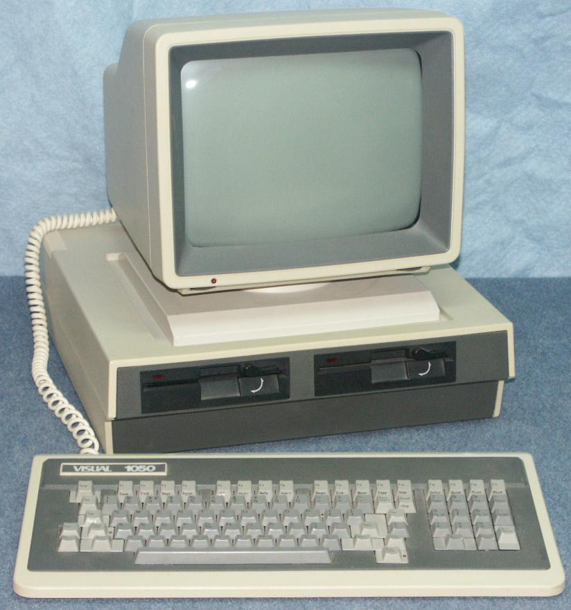

---

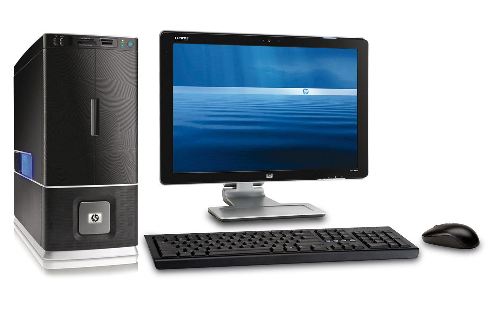

---

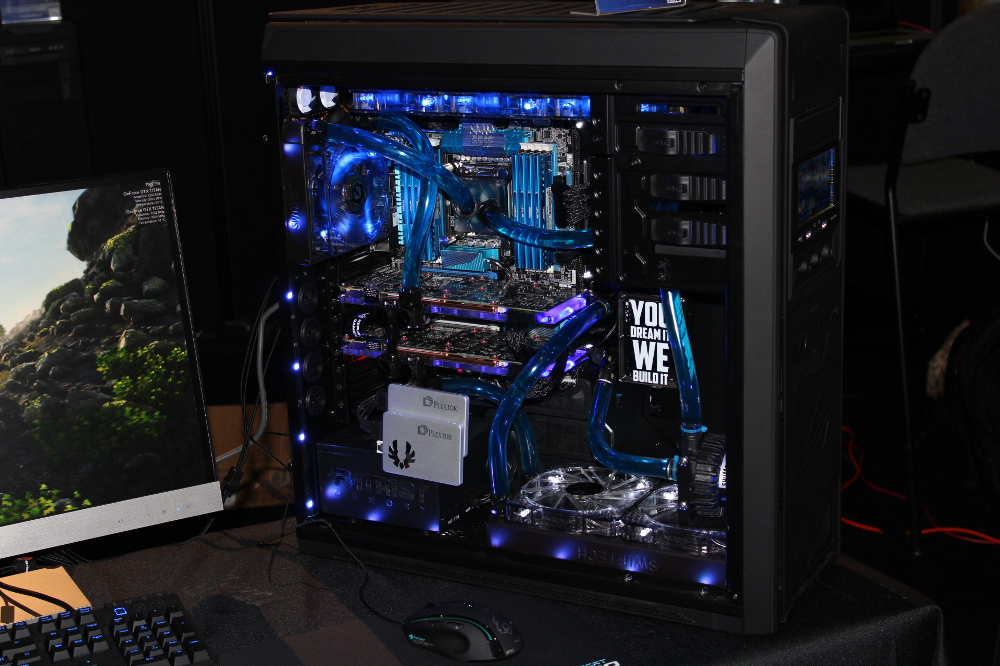

---
# Laptop ou Notebook
- Computador portátil, talvez o mais popular atualmente;
- Praticidade, baixo consumo;
- Completo com os periféricos básicos;
- Preços competitivos;
- Capacidade mais baixa se comparado à desktops do mesmo preço;
- Manutenção mais cara e difícil;
- Pouca possibilidade de *upgrade*.

---

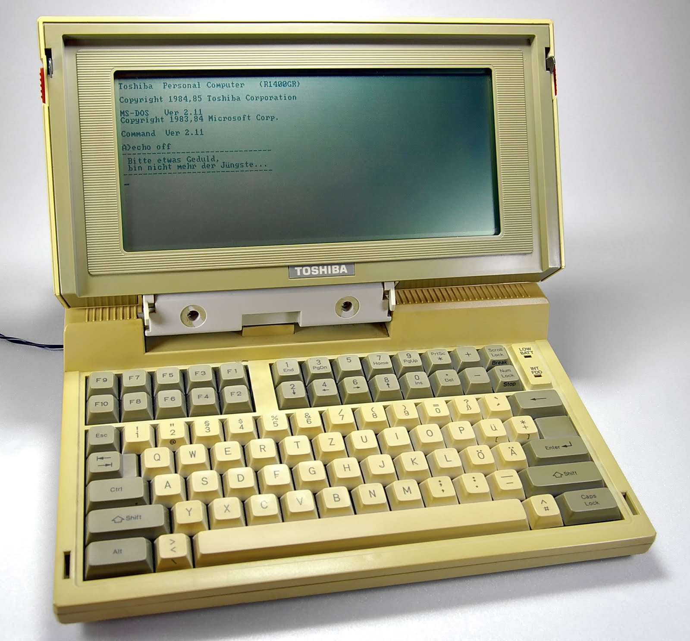

---

---

# Netbook
- Computador com foco no uso móvel e acesso à internet.
- Baixo custo;
- Baixa capacidade de processamento e armazenamento;
- Pouco confortável para uso;
- Atualmente em baixa, devido ao surgimento de outros dispositivos.

---

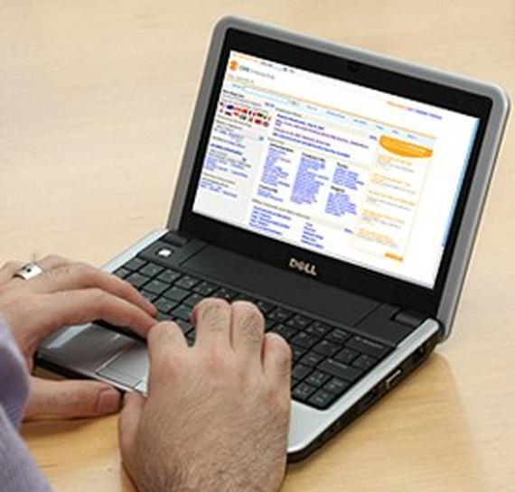

---

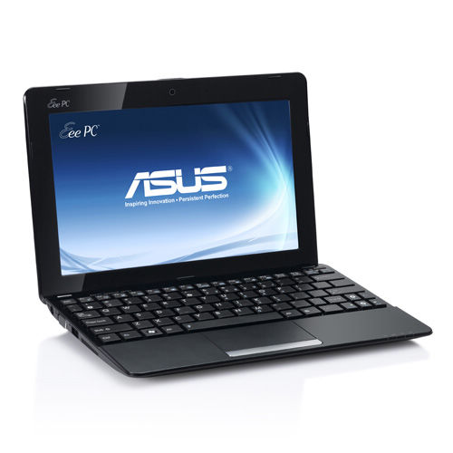

---

# Palmtop ou PDA
- PDA - *Personal Digital Assistent*;
- Precursores dos *smartphones* atuais;
- Basicamente um computador de mão;
- Permite o acesso à internet, utilização de ferramentas de escritório, etc;
- Atualmente utilizado principalmente em aplicações comerciais;
- Entregadores, leitor de medidor de consumo, representante de vendas, restaurantes, etc.

---

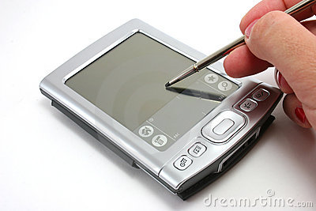

---

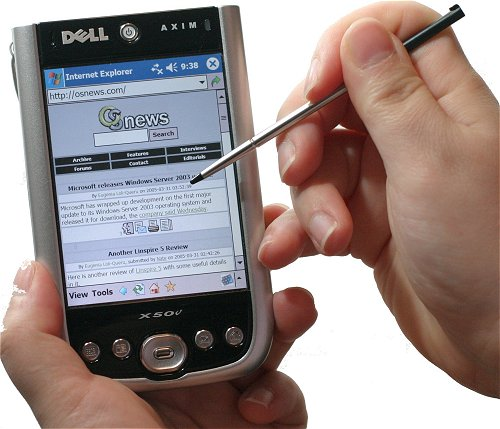

---

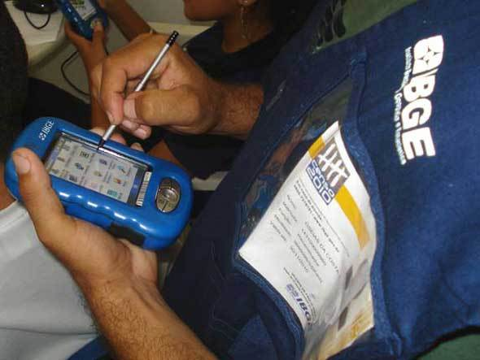

---
# Tablet
- Dispositivo focado no uso da internet e jogos;
- Interface *touch-screen*;
- Portabilidade com um bom tamanho de tela;

---

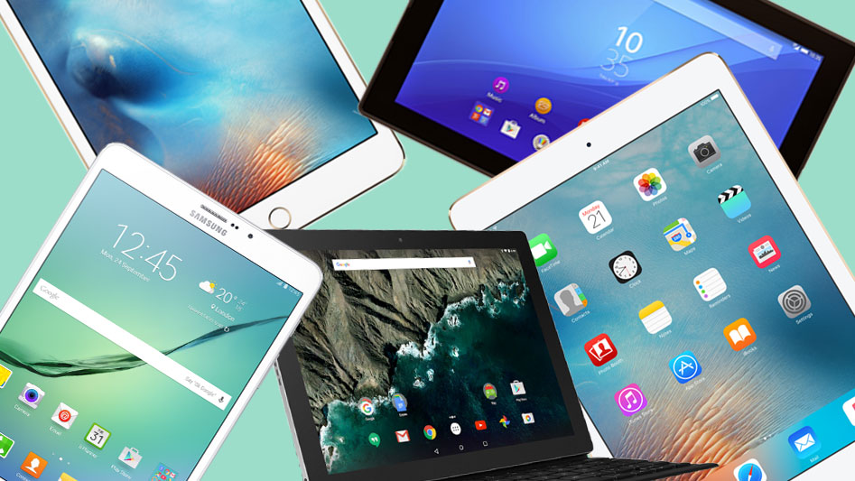

---

# Smartphone
- Une as funções de telefone e tablet em um único aparelho;
- Portabilidade;
- Praticidade;
- Grande capacidade computacional;
- Muitos aplicativos e serviços disponíveis.

---

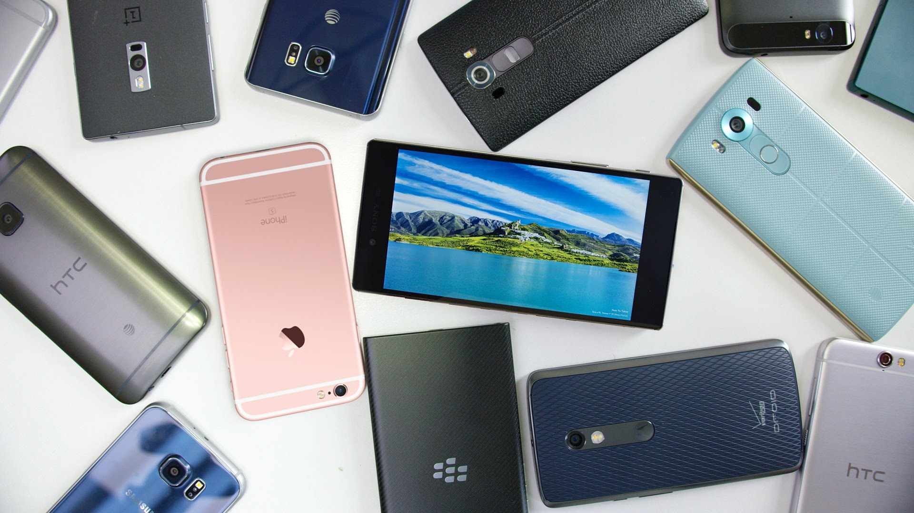

---

# <!--fit--> Dúvidas? 🤔
