

# <!--fit--> Informática
### Prof. Diego Cirilo
**Aula 03** Hardware

---
# Arquitetura de von Neumann

- Proposta por John von Neumann e outros em 1945 para uso no EDVAC;
- Também chamada de arquitetura Princeton por conta da universidade onde foi desenvolvida;
- Descreve a arquitetura do computador pessoal como conhecemos hoje;

---
# Arquitetura de von Neumann

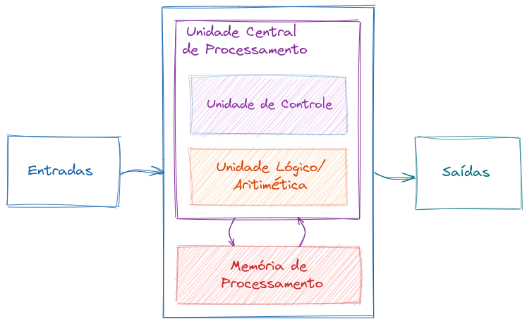

---
# Processador
- Responsável pelo "processamento" propriamente dito;
- Também chamado de CPU - *Central Processing Unit*;
- Realiza funções lógicas, aritméticas e de controle;
- Executa o *software*.

---

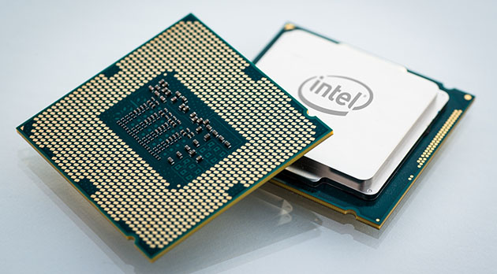

---

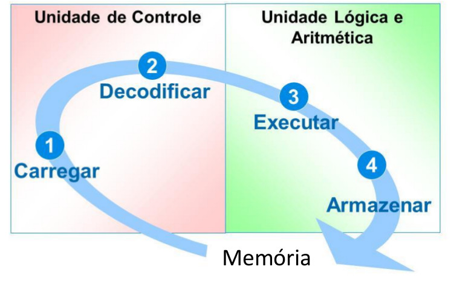

---

# Memórias
- Dispositivo responsável pelo armazenamento de dados e programas (von Neumann);
- Sua capacidade de armazenamento é medida em bytes e seus múltiplos (kB, MB, GB, TB, etc);
- Há dois tipos básicos em uso no computador:
    - Memória principal ou de processamento;
    - Memória secundária ou de armazenamento.
---
# Grandezas de memória

| **Tipo** | **Valor** |
|--|:--:|
| Bit           | Dígito Binário (0 ou 1) | 
| Byte (B)      | 8 bits                  | 
| Kilobyte (kB) | 1024 B                  |
| Megabyte (MB) | 1024 kB                 |
| Gigabyte (GB) | 1024 MB                 |
| Terabyte (TB) | 1024 GB                 |

---

# Memória Principal ou Memória de Processamento

- Utilizada para armazenar os dados e programas que estão sendo utilizados pelo processador;
- Também chamada de memória RAM, apesar de ser um termo histórico;
- Muito mais rápida que as memórias secundárias;
- Muito mais cara que as memórias secundárias;
- Várias tecnologias, atualmente DDR3 e DDR4;
- Podem ser substituídas facilmente.

---

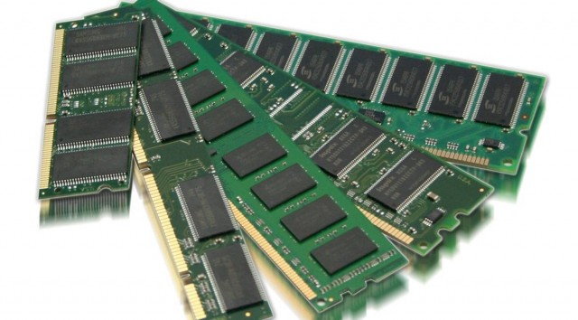

---

# Memória secundária ou de armazenamento

- Permite o armazenamento de grandes quantidades de dados com confiabilidade e baixo custo;
    - Cartão Perfurado;
    - Disco Magnético:
        - Disco flexível 3 1/2";
        - Disco rígido;
        - Zip Disk;
    - Disco Óptico:
        - CD, DVD, *Blu-Ray*;
    - Fita Magnética;
    - Memórias *Flash*.

---

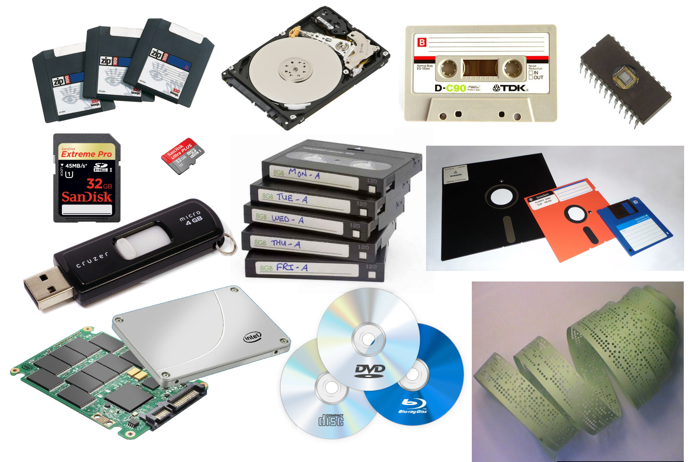

---
# Barramentos

- Vias de comunicação entre componentes de um sistema computacional;
- Fios, cabos, fibra óptica, sinais de rádio...
- Internos/Externos
- Velocidade em bits/segundo, ex. 80Mbps ou 10MB/s.

---
# Barramentos internos
- Internos ao computador, conectam o processador aos diversos dispositivos, inclusive a memória;
- Permitem a comunicação com dispositivos como:
    - Placas de vídeo;
    - Placas de rede;
    - Modems...
- Exemplos:
    - ISA, IDE, PCI;
    - I2C, PCI Express, SATA...

---

---  
# Barramentos externos

- Conectam o computador aos periféricos;
- Exemplos:
    - Paralela (LPT), Serial (RS-232), PS/2;
    - *Game*, USB, VGA, HDMI...

---

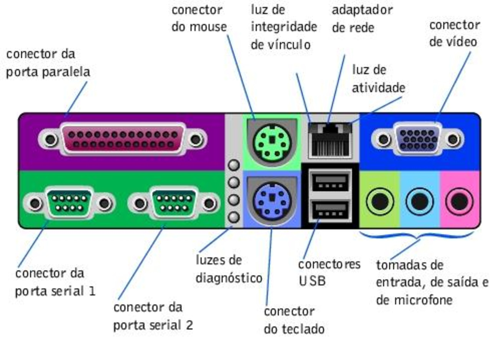

---

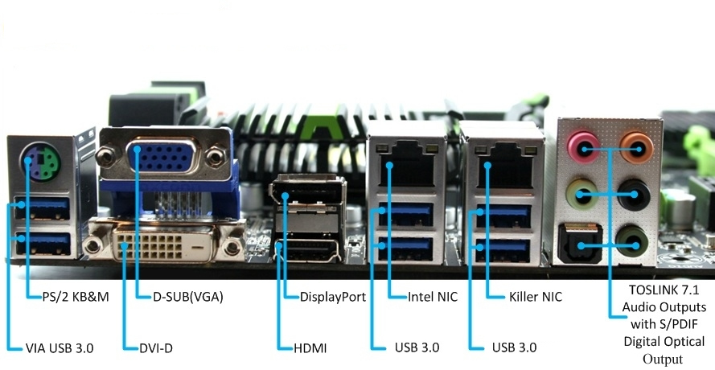

---
# Dispositivos de entrada

- Permitem que dados do mundo exterior sejam enviados ao computador;
- Exemplos:
    - *Mouse*;
    - Teclado;
    - *Scanner*;
    - Mesa digitalizadora...

---

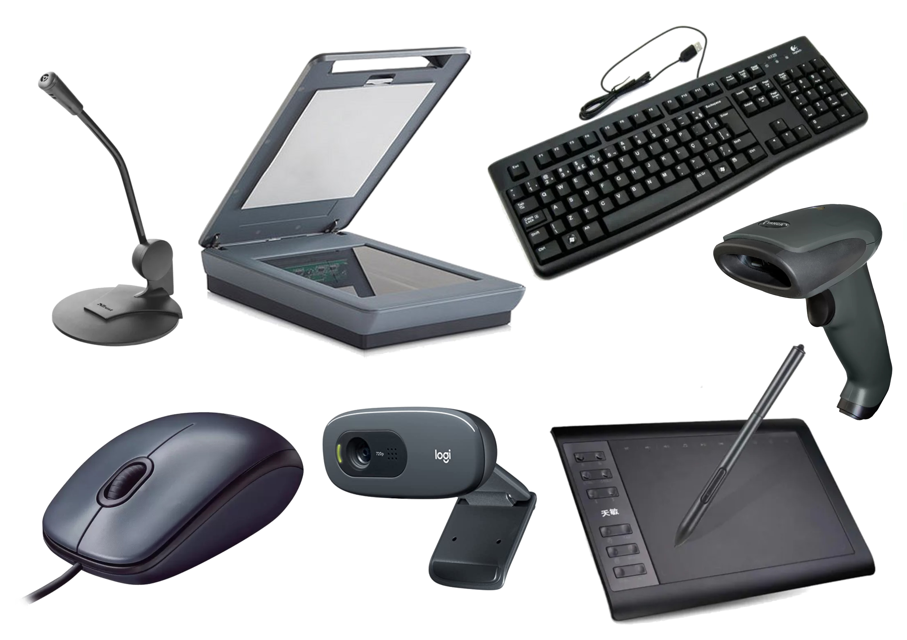

---
# Dispositivos de saída
- Permitem que o computador transfira dados internos para o mundo;
- Exemplos:
    - Monitores;
        - CRT;
        - LCD;
        - LED.
    - Impressoras;
        - Matricial;
        - Jato de Tinta;
        - *Laser*;
        - *Plotter*.

---

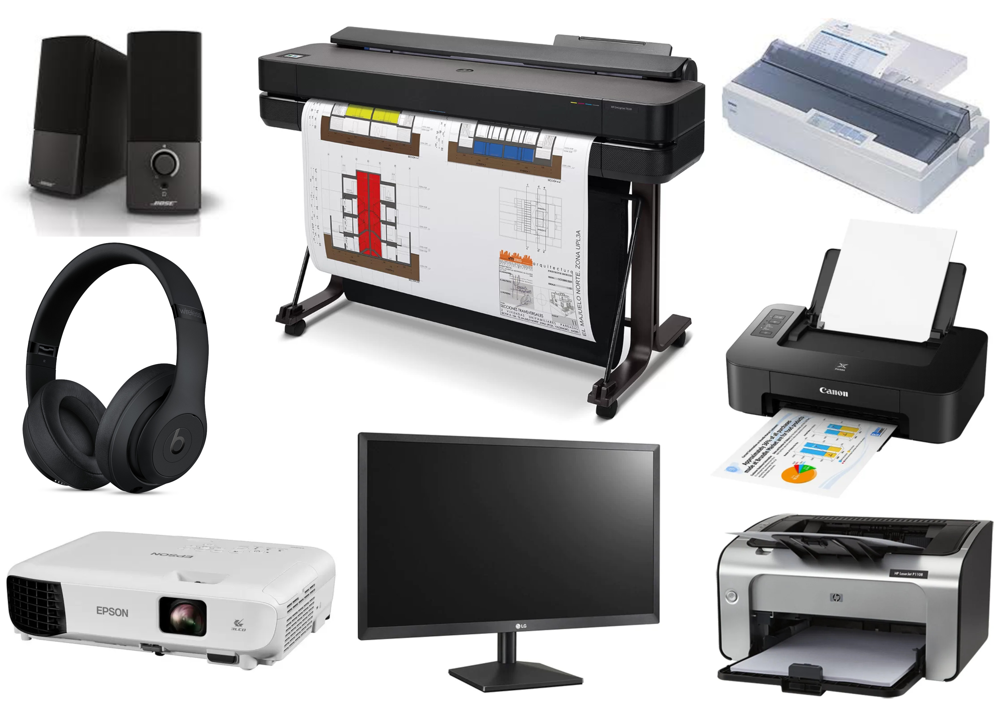

---
# Alimentação/Proteção

- O computador deve ser conectado à rede elétrica para utilização;
- É necessária uma instalação elétrica adequada para o uso seguro;
- Aterramento!
- Dispositivos de proteção elétrica:
    - Filtros de Linha;
    - Estabilizadores;
    - Módulos isoladores;
    - No-breaks.

---

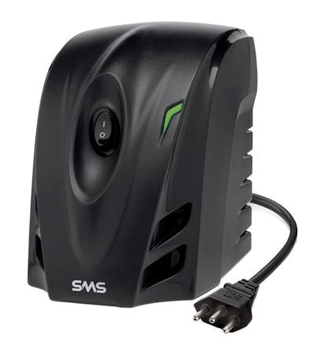
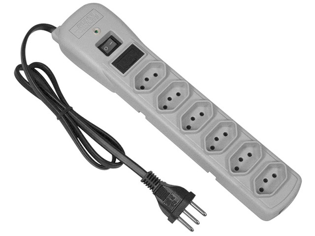
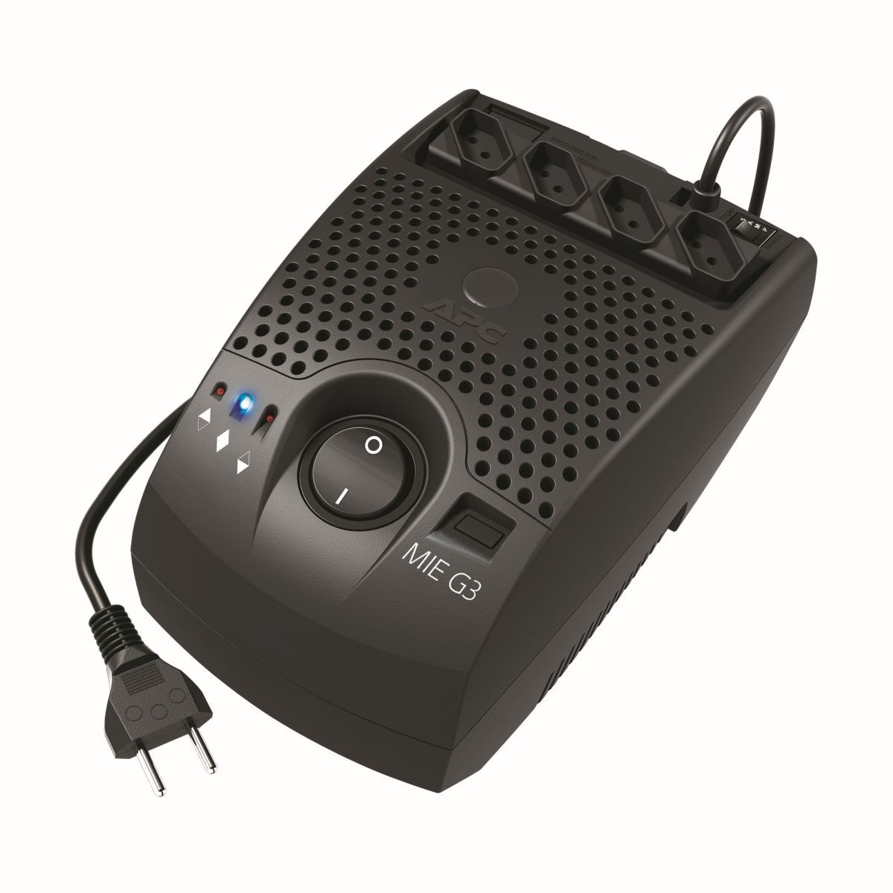
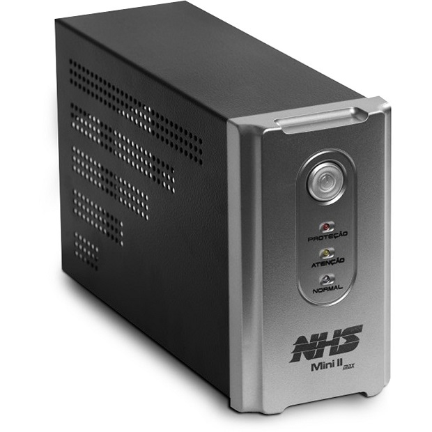

---

# Fonte de Alimentação
- Dispositivo que converte a tensão da rede elétrica para as tensões utilizadas no computador;
- Possui diversas saídas:
    - +5V;
    - +12V;
    - +3.3V;
    - -12V;
    - ...

---

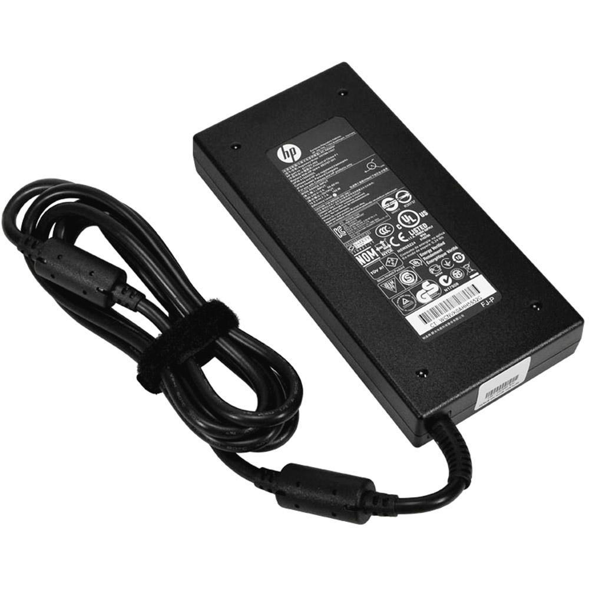

---

# Gabinete

- Dispositivo utilizado para abrigar os componentes do computador;
- Deve ser escolhido (se possível) para atender requisitos de:
    - Tamanho;
    - Robustez;
    - Ventilação;
    - Proteção contra poeira;
    - Ruído.

---

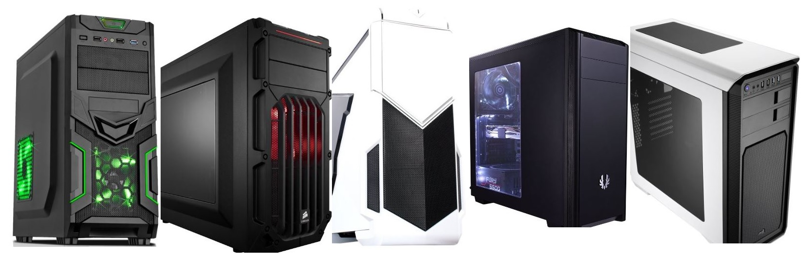

---

# <!--fit--> Dúvidas? 🤔
