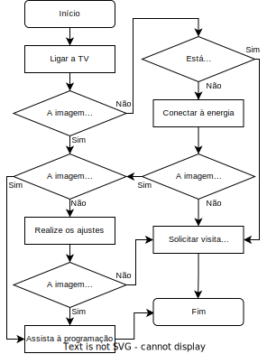
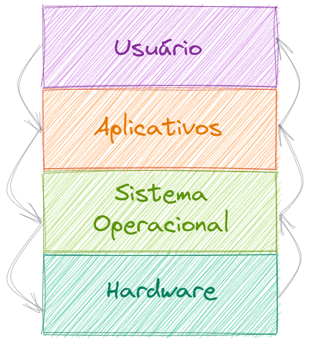
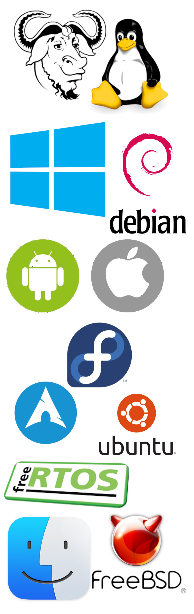
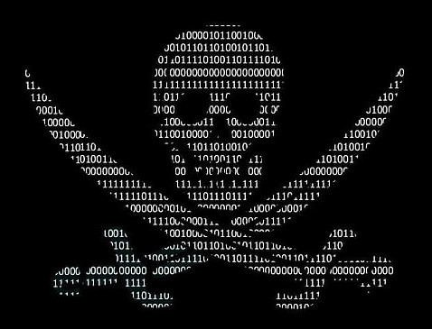

# <!--fit--> Informática
### Prof. Diego Cirilo
**Aula 04** Software

---

# Software
- Responsável por dar utilidade ao computador;
- Parte **lógica**: sistema operacional, aplicativos;
- Composto por **algoritmos**.



---

# Software
- Escrito por programadores/desenvolvedores em alguma **linguagem de programação**;
- C, C++, C#, Java, JavaScript, Ruby, Python, Perl, Haskell, Erlang, Go...
- Descreve as operações necessárias para processamento de dados.

---
# Exemplo (C)

```c
// Function to draw the boundaries
void draw()
{
    system("cls");
    for (i = 0; i < height; i++) {
        for (j = 0; j < width; j++) {
            if (i == 0 || i == width - 1
                || j == 0
                || j == height - 1) {
                printf("#");
            }
            else {
                if (i == x && j == y)
                    printf("0");
                else if (i == fruitx
                         && j == fruity)
                    printf("*");
                else
                    printf(" ");
            }
        }
        printf("\n");
    }
  
    // Print the score after the
    // game ends
    printf("score = %d", score);
    printf("\n");
    printf("press X to quit the game");
}
```

---
# Exemplo (Python)

```python
from urllib.request import Request, urlopen
import json
from pprint import pprint

MATRICULA = ''
TOKEN = ''
AUTHORIZATION = ''

req = Request('https://suap.ifrn.edu.br/api/v2/edu/alunos/{}/'.format(MATRICULA))
req.add_header('Accept', 'application/json')
req.add_header('X-CSRFToken', TOKEN)
req.add_header('Authorization', AUTHORIZATION)

resposta = urlopen(req)
dados_byte = resposta.read()
dados_txt = dados_byte.decode('utf-8')
dados = json.loads(dados_txt)

pprint(dados)
```

---

# Tipos de Softwares

- Sistemas Operacionais
    - Responsáveis pelo gerenciamento do hardware, aplicativos e interface de usuário;
    - Disponibilizam funcionalidades para os aplicativos;
- Aplicativos
    - Fornecem funcionalidades para o usuário.



---

# Sistemas Operacionais

- Microsoft Windows (95, 98, Me, NT, XP, 7, 8, 10, 11)
- Mac OSX
- Linux (Ubuntu, Mint, Debian, Fedora, etc.)
- Móveis:
    - Android e iOS
- Unix, FreeBSD, FreeRTOS, Mbed OS...



---

# Aplicativos
- Escritório
    - Editor de textos
    - Planilhas
    - Apresentação de slides
- CAD/CAM
- Produção multimídia
- Navegadores web (*browsers*)
- Utilitários
    - Compactadores
    - Players
    - Leitores de PDF

---

# Tipos de distribuição
- Software comercial
- *Freeware*
- *Shareware/Adware/Freemium*
- ~~Software Pirata~~
- Software Livre
- *Software as a Service* - SaaS

---
# Software Comercial
- O usuário deve pagar pelo produto;
- Normalmente uma licença vitalícia para a versão comprada;
- Suporte do vendedor;
- Atualizações;
- Descontos para estudantes;
- Ex. Windows, Pacote Office, AutoCAD...

---
# Freeware
- Software Gratuito
- Versão completa e gratuita
- Ex. Whatsapp, Telegram, Winamp, Foxit Reader...

---
# Shareware/Adware/Freemium
- Software inicialmente gratuito, mas com funcionalidade limitada;
- Limite de tempo, marca d'água, propagandas, etc;
- Ex. Jogos.

---
# Software Pirata
- Software comercial ou shareware modificado para funcionar sem a licença;
- Também chamado de *crackeado*;
- Falhas de segurança;



---
# Software Livre
- Disponibilizado gratuitamente junto ao seu *código-fonte*;
- Richard Stallman/GNU/FSF
- Permite colaboração no desenvolvimento e auditoria na segurança;
- Ex. Chrome, Firefox, Linux, Android, GIMP, Blender, LibreOffice, VLC Media Player...


---
# Software as a Service - SaaS
- Software como serviço;
- Demanda uma assinatura, e não mais a aquisição do software;
- Modelo de negócio mais lucrativo;
- Ex. Ferramentas Adobe, Office 360...


---
# Obtendo software
- *App stores*;
- Site do desenvolvedor;
- ~~Sites genéricos~~.

---

# <!--fit--> Dúvidas? 🤔
