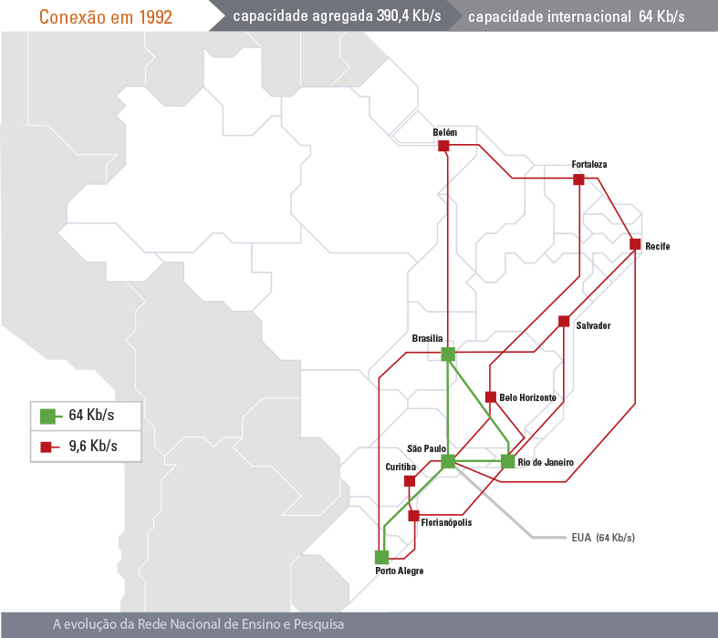
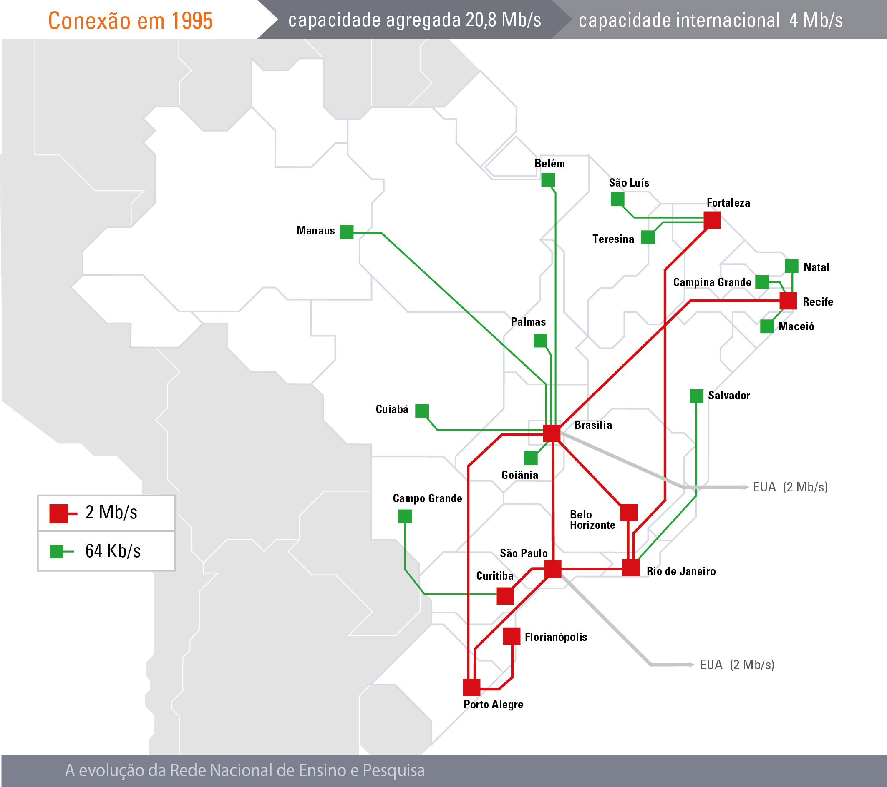
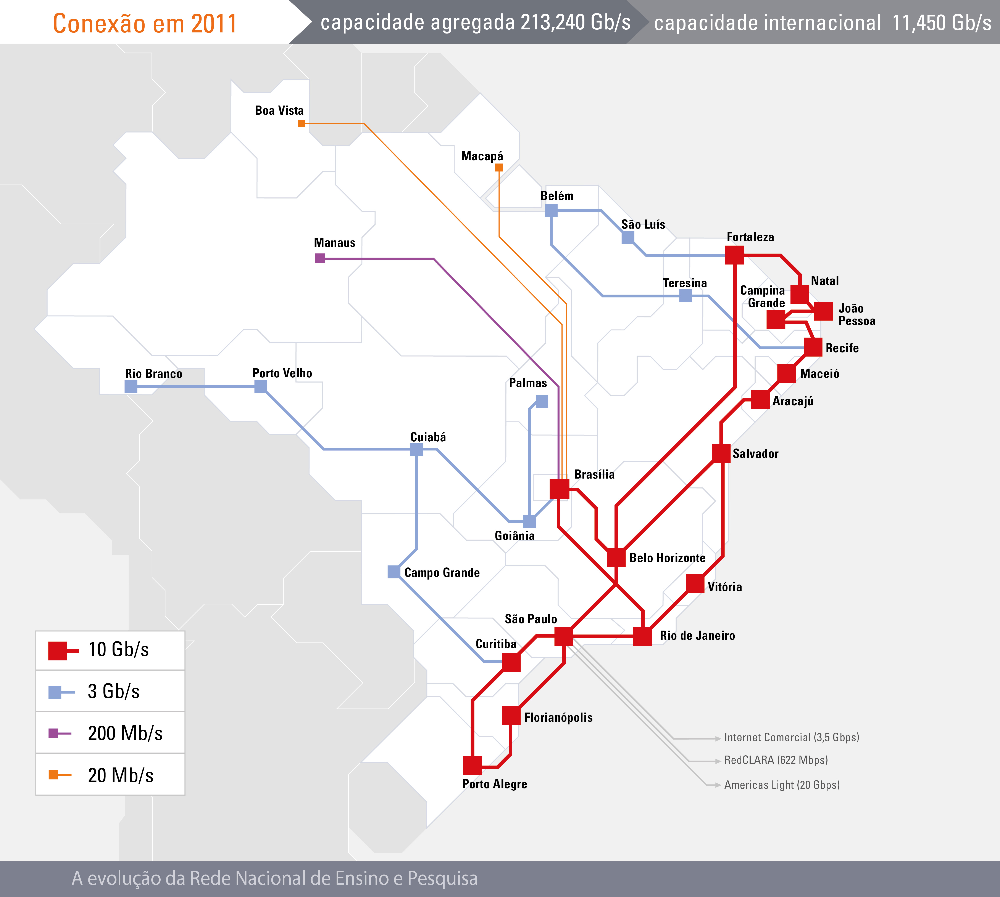
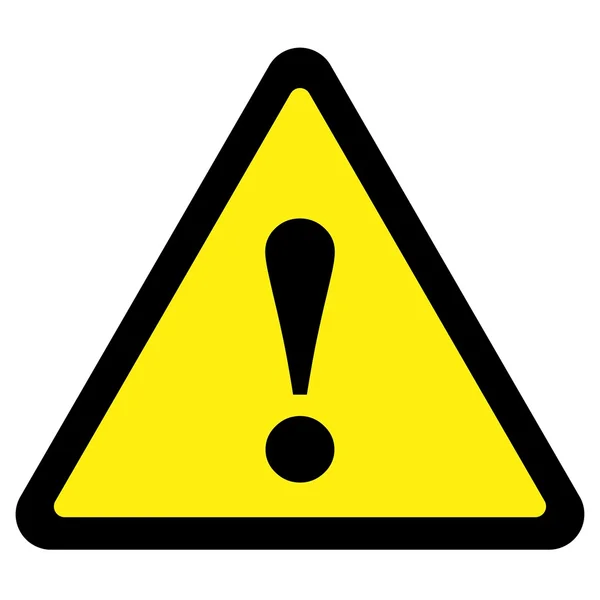

# <!--fit--> Informática
### Prof. Diego Cirilo
**Aula 05** Internet e Segurança da Informação

---
# Histórico
- A internet começou a ser criada com o projeto do governo americano chamado **ARPANET**
- Tinha o objetivo de interligar Universidades e Instituições de pesquisa e militares

---
# Histórico
- Em 1980 várias outras universidades foram incorporadas
- Em 1985 a NSF (*National Science Foundation*) interligou seus computadores em rede;
- Em 1986 a NSF se junta à ARPANET e essa rede passa a ser chamada de *Internet*;
- Em 1989 a FAPESP (Fundação de Amparo à Pesquisa do Estado de São Paulo) e a LNCC (Laboratório Nacional de Computação Científica) se ligam a Internet
- No mesmo ano foi criada a RNP (Rede Nacional de Pesquisa)

---
# Histórico
- Em 1991 o cientista Tim Berners-Lee do CERN cria o WWW (*World Wide Web*)
    - Antes só existia email, FTP e Telnet
- Depois do WWW foi criado o Mosaic, o primeiro navegador para *web*.
- Em 1993 a internet é aberta para exploração comercial nos EUA, e o mesmo ocorre um ano depois no Brasil;

---
# RNP em 1992

---
# RNP em 1995

---
# RNP em 2011

---
# RNP em 2021

---
# WWW
- Sistema de informação que utiliza a internet como meio de transmissão
- Conceitos:
    - HTTP - Protocolo de transmissão de hypertexto
        - Realiza a comunicação com um servidor Web
    - URL - Sistema de endereços
        - `http://www.ifrn.edu.br/`
    - HTML - Linguagem de marcação de texto
        - Formatação para texto, inserção de imagens e *links*
    - FTP - Protocolo de transmissão de arquivos

---
# Acesso à *internet*
- Acesso Discado (*dial-up*)
    - [Som](https://www.youtube.com/watch?v=GSRG0TqxLWc)
- Conexão Banda Larga
    - ADSL
    - Cabo
    - Rádio
    - Fibra óptica

---
# Conceitos importantes
- Endereços
    - Ex. *www.ifrn.edu.br*
    - Primeiro nível:
        - .br indica o país. Ex. *.it*, *.pt*, *.mx*
        - Quando não possui o endereço é americano ou internacional.
    - Segundo nível:
        - Tipo de instiuição. Ex. *.edu*, *.com*, *.gov*
    - Terceiro:
        - Nome do site
    - Quarto:
        - Tipo de serviço. Ex. *www*, *mail*, *suap*, etc.

---
# Conceitos importantes
- Cookies
    - Arquivos de informações do usuário, identificando-o para o próximo acesso.
    - Armazenam preferências e dados de navegação.
    - No passado era alvo de *hackers*.
- Cache
    - Espaço para armazenar páginas utilizadas recentemente
    - Acelera o acesso das páginas.

---
# Conceitos importantes
- Navegador ou *browser*
    - Aplicativo responsável pelo acesso às páginas web.
    - Ex. Google Chrome, Internet Explorer, Microsoft Edge, Mozilla Firefox, Opera, Brave, Chromium...
- Mecanismos de busca
    - Site que armazena informações e permite pesquisa por termos
    - Ex. Google, DuckDuckGo, Bing.

---
# <!--fit--> Segurança da Informação

---
# Segurança da Informação
- O bem mais valioso de um sistema computacional são os dados.
> A segurança da informação é um conjunto de medidas que se constituem basicamente de **controles** e **política de segurança**, tendo como objetivo a proteção das informações dos clientes e da empresa (**ativos/bens**), controlando o **risco** de revelação ou alteração por pessoas não autorizadas.

---
# Mecanismos de segurança
- Controle Físico
    - Barreiras que limitam o contato ou acesso direto à informação.
    - Ex. portas, paredes, trancas, blindagem, guardas.
- Controle Lógico
    - Barreiras que limitam o acesso à informação em ambiente eletrônico.
    - Ex. criptografia, senhas, biometria, firewall.

---
# Vírus
- São programas criados para causar danos
    - Apagando dados
    - Capturando informações
    - Operando indevidamente o hardware do usuário

---
# Tipos de virus
- Worm
- Trojan (Cavalo de Tróia)
- Spyware, Keylogger
- Hijacker, cryptojacker
- Ramsonware

---
# Outras ameaças
- Phishing
- Engenharia social
- Mensagens fraudulentas
- Golpes
---
# Ferramentas de proteção
- Antivirus
- Firewall
- Atualizações
- **Conhecimento**
---
# Backup
- Dados de armazenamento podem sofrer danos físicos ou perda/roubo.
- Backups são cópias de segurança.
- Múltiplas localizações físicas e geográficas.
- Nuvem.

---
# Dicas gerais de segurança
- Sempre saia de sites utilizando o botão de sair/logout.
- Crie senhas difíceis de adivinhar, mas fáceis de lembrar.
    - Letras, números e símbolos.
- Mude as senhas periodicamente
- Não repita senhas em sites que possuam dados importantes.
- Mantenha seus programas atualizados.
- Não clique em links suspeitos.
- Faça backups de seus arquivos importantes.
- Segurança é mais importante que conveniência.
- Sempre desconfie.

---

# <!--fit--> Dúvidas? 🤔
